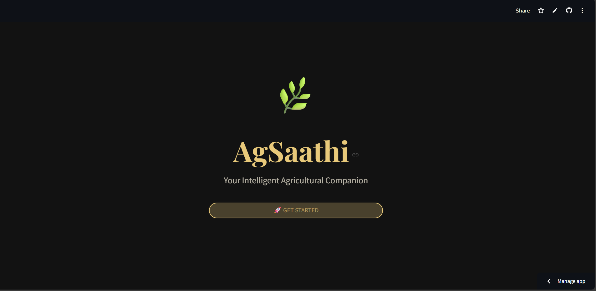
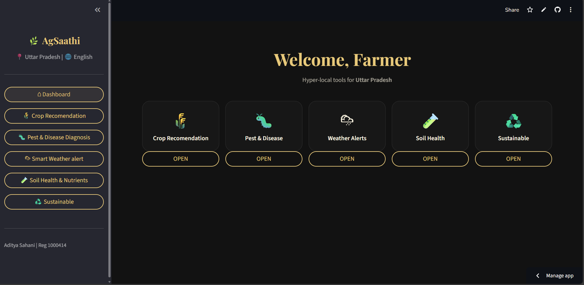
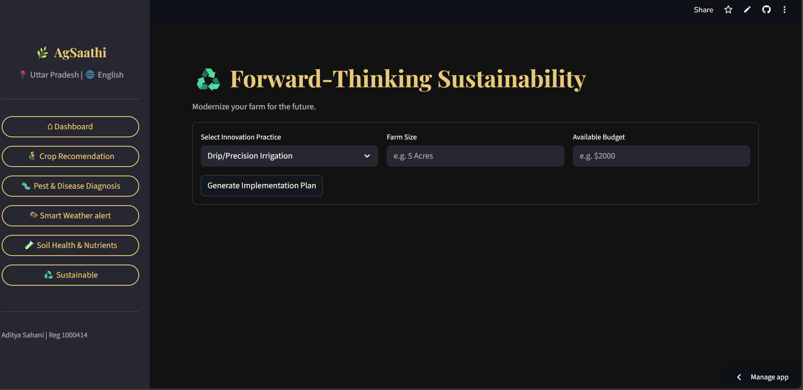

# 🌿 AgSaathi — AI-Powered Smart Farming Assistant


**Student Name:** Zene Sophie Anand
**Student ID:** 1000442  
**Course:** Generative AI  
**School:** Aspee Nutan Academy  
**Assessment Type:** FA-2  
**Project Title:** Design and Deploy an AI-Powered Interactive Python Application  

---

## � Project Links

| Resource | Link |
|----------|------|
| 🚀 Live App | [Open Live App](https://idai103-1000442-zene-sophie-anand-dj2nbhahfqgcfogkut5zc4.streamlit.app/) |
| 🎨 Canva Storyboard | [View Storyboard](https://www.canva.com/design/DAG9wn0Lpxc/KwGSYPuD3LXNNTeJulw-BA/edit) |

---

## �📋 Project Overview

**AgSaathi** is an AI-powered smart farming assistant built using **Python**, **Streamlit**, and **Google Gemini**. It provides hyper-local agricultural intelligence to farmers across India, Canada, and Ghana — covering crop recommendations, pest & disease diagnosis, smart weather alerts, soil health analysis, and sustainable farming guidance.

The project transforms complex agricultural knowledge into a **clear, conversational, and personalized dashboard**, helping farmers make better decisions based on their specific region, language, and resources.

This project demonstrates the complete lifecycle of a generative AI application — from onboarding design and prompt engineering to cloud deployment.

---

## ❗ Problem Statement

Smallholder farmers worldwide struggle to access timely, localized, and actionable agricultural advice. Traditional resources are often:
- Generic and not region-specific
- Available only in English
- Difficult to access without an internet-connected expert

**AgSaathi** addresses these challenges by:
- Delivering AI-powered, hyper-local crop and pest advice
- Supporting multiple languages (English, Hindi, French)
- Providing an easy-to-use, mobile-friendly web interface

---

## 🎯 Project Objectives

- Demonstrate **Generative AI integration** using Google Gemini API  
- Design a **multi-step onboarding** flow for personalized user experience  
- Apply **structured prompt engineering** for consistent JSON-formatted AI responses  
- Build a **modular, feature-rich Streamlit interface** with 5 agricultural tools  
- Deploy a fully functional application using **Streamlit Cloud**

---

## ✨ Key Features

### 🛒 Core Functionality
- Multi-step onboarding: Country → Region → Language selection
- 5 AI-powered tools accessible from a persistent sidebar navigation
- All AI responses are returned in structured JSON format for reliable rendering
- AI confidence scores displayed with visual progress bars

### 🌾 Agricultural Modules
- **Crop Recommendation** — Region and resource-based crop suggestions with risk levels
- **Pest & Disease Diagnosis** — Symptom-based diagnosis with treatment steps and organic options
- **Smart Weather Alerts** — Forecast-based action plans (24hr and 7-day)
- **Soil Health & Nutrients** — pH and NPK analysis with amendment recommendations
- **Sustainable Farming** — Step-by-step implementation plans for modern farming practices

### 📊 Visual Dashboard
- Feature card grid on the home dashboard
- Risk-level color badges (LOW / MEDIUM / HIGH)
- Crop compatibility scores with dynamic color coding
- AI Confidence Score bar for each recommendation

---

## 🌐 Supported Regions & Languages

| Country | Regions | Languages |
|---------|---------|-----------|
| 🇮🇳 India | Uttar Pradesh, Punjab, Bihar, Madhya Pradesh, Maharashtra, Gujarat | English, Hindi |
| 🇨🇦 Canada | Ontario, Quebec, Saskatchewan, Alberta | English, French |
| 🇬🇭 Ghana | Ashanti, Northern, Greater Accra, Volta | English |

> **Design Note:** Region and language selection ensure that all AI responses are contextually relevant, culturally appropriate, and accessible to farmers with varying literacy levels.

---

## 🎨 User Interface Design

- Dark earthy color palette (soil brown `#1A0F07`, wheat gold `#E8C97A`, sage green `#4A7C59`)
- Google Fonts: **Playfair Display** (headings) + **Nunito Sans** (body)
- Feature cards with hover lift animations
- Streamlit session state used for persistent multi-page navigation
- Clean card-based layout for all AI result displays

---

## 🔧 Technical Architecture

### Technologies Used
- **Python** — core application logic and prompt engineering
- **Streamlit** — interactive web interface and session state management
- **Google Gemini API** (`google-generativeai`) — generative AI backbone
- **JSON / Regex** — structured response parsing from AI output
- **Datetime** — date handling and display
- **Streamlit Secrets** — secure API key management

### Data Structures
- Dictionaries for geo-data (countries → states → languages)
- Session state dictionary for user profile persistence across pages
- Lists for AI-generated recommendation arrays (crops, treatment steps, actions)

### Prompt Engineering Strategy
Each module uses a **structured JSON prompt pattern**:
```
Language: {language}. Location: {state}. Task: {task_name}.
Inputs: {user_inputs}.
JSON format exactly: { "key": "value", ... }
```
This ensures consistent, parseable AI responses that can be rendered as structured UI cards.

---

## 📁 Project Structure

```text
FA/
│
├── app.py                  # Main Streamlit application (all 5 modules)
├── requirements.txt        # Python dependencies
├── README.md               # Project documentation
│
└── assets/                 # App screenshots and documentation images
    ├── Onboarding.png
    ├── Language Selection.png
    ├── Farm Selection.png
    ├── Region Selection.png
    ├── Dashboard.png
    ├── Crop Recomendation.png
    ├── Pest Diagonis.png
    ├── Smart Weather Alerts.png
    ├── Soil Health.png
    └── Sustainibility.png
```

---

# 📁 Project Development Stages

### 🧠 Stage 1: Planning & Design

The planning stage focused on identifying the core pain points of smallholder farmers and designing an onboarding flow that personalizes every AI interaction. The multi-step flow (Country → Region → Language) was chosen to ensure all downstream AI prompts are hyper-local and language-appropriate.

**Key design decisions:**
- Use of session state to persist the user profile across all 5 modules
- Dark earthy theme to resonate with the farming and nature context
- Card-based layout to make AI output easy to scan at a glance

---

### 🧮 Stage 2: Build the Python Logic

- Configured Google Gemini API with `@st.cache_resource` to avoid redundant model initialization
- Designed the `call_ai()` helper function to robustly parse JSON from Gemini's free-text output using regex extraction (`text.find('{')` ... `text.rfind('}')`)
- Built the `render_confidence_bar()` to visually communicate AI certainty (green ≥ 80%, orange ≥ 50%, red below)
- Applied geo-data dictionaries to drive country, state, and language selection dynamically

---

### 🖥️ Stage 3: Interactive Interface

The interface was developed module-by-module, with a consistent sidebar navigation and card-based result display across all 5 tools.

#### 📸 App Screenshots

**Onboarding Flow**

| Hero / Launch Screen | Country Selection |
|---------------------|-------------------|
|  |  |

| Region Selection | Language Selection |
|-----------------|-------------------|
|  |  |

*Figure 1: Multi-step onboarding flow — Hero → Country → Region → Language*

---

**Main Application**

| Home Dashboard | Crop Recommendation |
|---------------|---------------------|
|  |  |

| Pest & Disease Diagnosis | Smart Weather Alerts |
|--------------------------|----------------------|
|  |  |

| Soil Health & Nutrients | Sustainable Farming |
|------------------------|---------------------|
|  |  |

*Figure 2: All 5 AI-powered modules — Crop Recommendation, Pest Diagnosis, Weather Alerts, Soil Health, and Sustainable Farming.*

---

### 🧪 Stage 4: Testing & Validation

Testing was conducted across multiple region and language combinations to validate that:
- AI responses are correctly formatted as JSON across all 5 modules
- The `call_ai()` parser handles edge cases where Gemini wraps JSON in markdown code fences
- Risk badge colors render correctly for LOW / MEDIUM / HIGH classifications
- Confidence score bar updates dynamically and displays correct color thresholds

**Language Testing:** All 5 modules were tested in Hindi and French to ensure Gemini correctly responds in the language specified in the prompt.

**Edge Case Handling:** The `call_ai()` function gracefully catches and displays user-friendly error messages if JSON parsing fails, preventing application crashes.

---

### 🚀 Stage 5: Integration & Deployment

The finalized **AgSaathi** application was fully integrated and deployed during this stage. All modules, the onboarding flow, sidebar navigation, and CSS theming were combined into a single `app.py` and hosted on **Streamlit Cloud**.

---

### 🔗 Technology Integration

AgSaathi integrates multiple Python libraries and Streamlit features:

- **Google Gemini API** – Powers all 5 AI modules with structured JSON prompt responses
- **Streamlit** – Handles layout, sidebar navigation, forms, session state, and real-time UI updates
- **`@st.cache_resource`** – Caches the Gemini model object to avoid repeated API initialization
- **Session State** – Persists user country, state, language, nav selection, and query stats across page rerenders
- **Regex + JSON** – Robustly extracts and parses AI JSON output from free-text Gemini responses
- **Streamlit Secrets** – Securely stores and retrieves the `GEMINI_API_KEY` without hardcoding

---

## 🚀 Deployment Instructions

### Prerequisites
- Python 3.8 or higher installed
- pip package manager
- A valid **Google Gemini API key** (get one free at [ai.google.dev](https://ai.google.dev))

---

### 💻 Local Deployment

Clone the repository:

```bash
git clone https://github.com/adityasahani392217/FA.git
cd FA
```

Install required dependencies:

```bash
pip install -r requirements.txt
```

Create a secrets file for the API key:

```bash
mkdir .streamlit
echo 'GEMINI_API_KEY = "your-api-key-here"' > .streamlit/secrets.toml
```

Run the Streamlit application:

```bash
streamlit run app.py
```

Access the app in your browser at:

```
http://localhost:8501
```

---

### ☁️ Cloud Deployment (Streamlit Cloud)

1. Push the complete project to GitHub
2. Visit [https://streamlit.io/cloud](https://streamlit.io/cloud)
3. Sign in using your GitHub account
4. Click **"New app"**
5. Select the AgSaathi GitHub repository
6. Set the main file path to: `app.py`
7. Go to **Advanced settings → Secrets** and add:
   ```
   GEMINI_API_KEY = "your-api-key-here"
   ```
8. Click **Deploy**

Streamlit Cloud automatically installs dependencies and hosts the application with a public URL.

---

## 🌱 Ethical & Social Considerations

- AI responses are advisory only and should be validated by local agricultural experts before major farming decisions
- The application supports multiple languages to reduce the digital accessibility gap for non-English-speaking farmers
- No personal or farm data is stored — all session data is ephemeral and cleared on browser refresh
- Demonstrates ethical use of generative AI for social good and rural empowerment

---

## 📌 Conclusion

AgSaathi demonstrates the full lifecycle of a Generative AI-powered application — from structured prompt engineering and multi-module design to cloud deployment. It shows how AI can make specialized agricultural expertise universally accessible, helping farmers grow smarter and more sustainably.

---

## 👥 Contributors

| Name | WACP No. |
|------|----------|
| Aditya Jitendra Kumar Sahani | 1000414 |
| Mann Paresh Patel | 1000428 |
| Zene Sophie Anand | 1000442 |

---

## 📚 References

1. [Streamlit Documentation](https://docs.streamlit.io/)
2. [Google Generative AI Python SDK](https://ai.google.dev/gemini-api/docs/quickstart?lang=python)
3. [Python Software Foundation](https://docs.python.org/3/)

---

**Grow Smarter • Farm Sustainably • Powered by AI 🌿**
